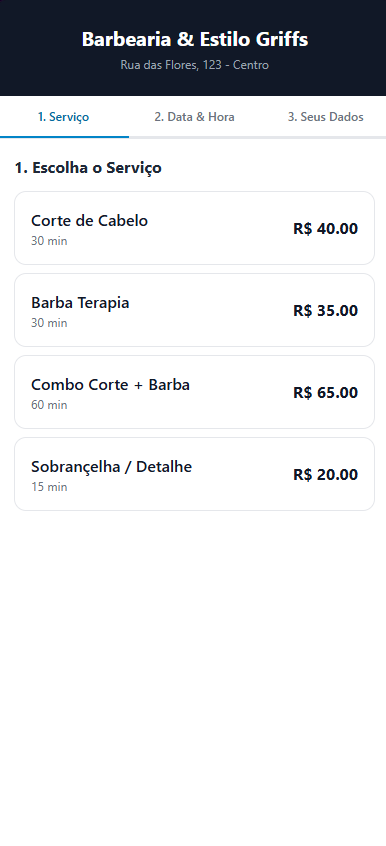
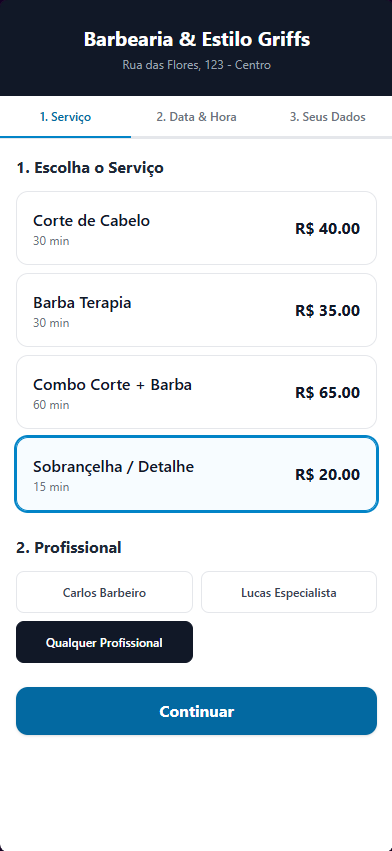
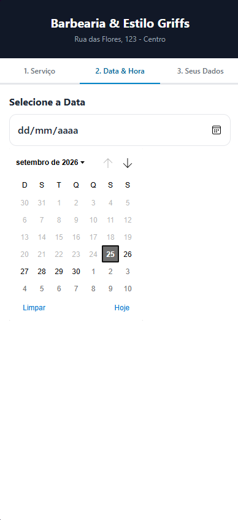
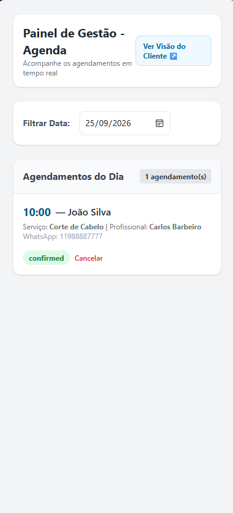

# 📅 AgendaFlex

> MVP de plataforma de agendamentos para negócios que precisam organizar serviços, profissionais e horários de forma simples e moderna.

O projeto foi pensado para atender barbearias, clínicas, estúdios, pet shops e prestadores de serviços que desejam oferecer uma experiência de agendamento rápida no celular e também um painel administrativo para acompanhar os atendimentos do dia.

---

## 📸 Screenshots

### Visão do cliente

Fluxo mobile-first em 3 etapas: seleção de serviço, escolha de profissional e data/hora, e confirmação do agendamento.

| Etapa 1 | Etapa 2 | Etapa 3 |
| :---: | :---: | :---: |
|  |  |  |

### Painel do gestor

Visualização dos agendamentos do dia com filtro por data, nome do cliente, serviço, profissional e status do atendimento.



---

## ✨ Funcionalidades

- Fluxo de agendamento em 3 passos
- Seleção de serviço e profissional
- Escolha de data e horário disponível
- Cadastro de dados do cliente
- Confirmação do agendamento com persistência em LocalStorage
- Painel administrativo para visualizar agendamentos do dia
- Filtro por data
- Controle de status de atendimento

---

## 🧩 Stack tecnológica

- Vue 3
- Vite
- Vue Router
- Tailwind CSS
- LocalStorage para mock de persistência

---

## 🚀 Como executar localmente

### Pré-requisitos

- [Node.js](https://nodejs.org/) 18+
- npm

### Passo a passo

1. Clone o repositório:

```bash
git clone https://github.com/michaelmdrs/app-agendamentos.git
cd app-agendamentos
```

2. Instale as dependências:

```bash
npm install
```

3. Inicie o ambiente de desenvolvimento:

```bash
npm run dev
```

4. Acesse no navegador:

```text
http://localhost:5173/
```

### Rotas principais

- Cliente: `/`
- Admin: `/admin`

---

## 📝 Observações

Este projeto está em estágio MVP e usa LocalStorage como base de dados mock para simular a persistência dos agendamentos durante o desenvolvimento. A estrutura já está pronta para evoluir para integração com backend e banco real em etapas futuras.

---

## 🔗 Repositório

- GitHub: https://github.com/michaelmdrs/app-agendamentos

